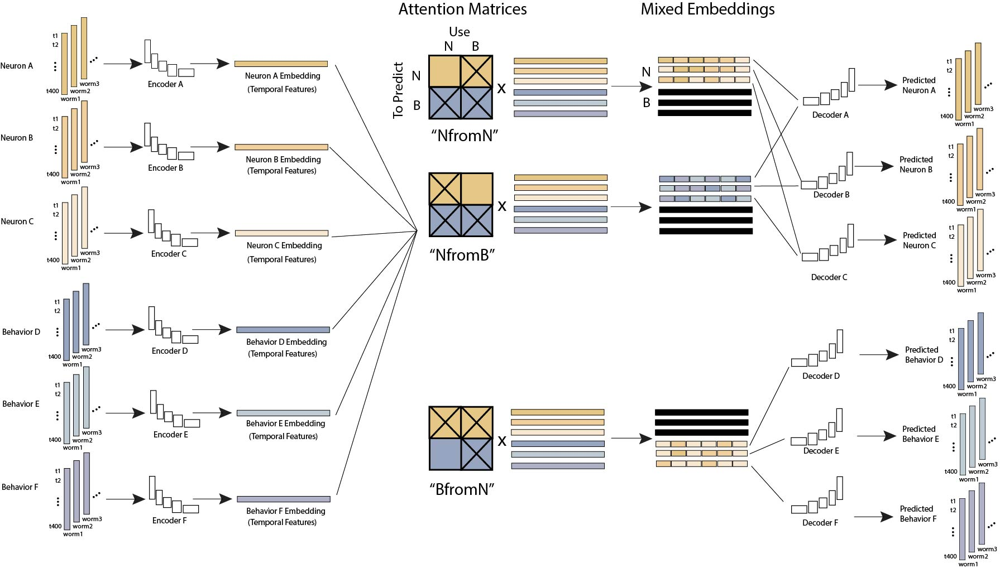

# A step-by-step guide for training and evaluating the attention model

#  Data preprocessing

1 - Assembling raw data
----------------------
The attention model takes in a 3-D tensor of shape `(num_datasets, num_inputs,
length)`, where `num_inputs` is `num_neurons` + `num_behaviors`. Suppose we
have such a data tensor named `x`. Then, `x[k, :num_neurons, :]` gives the
activities of all the neurons recorded in dataset with index `k`; `x[k,
num_neurons:, :]` gives the activities of all the behaviors recorded in dataset
indexed `k`.

*Caveat: heat-stim could be treated either equivalently as a neuron or
equivalently as a behavior, depending on whether we want to utilize it as a
context variable to perform prediction. When assembling our data, the order
should be **neuron-HeatStim-behavior**, and the neurons should be ordered exactly
as `neuron_classes` in the following code block. Order matters.*

To assemble this data matrix, go to`attention_predict/scripts/write.py` and run the following block:
```py
ds_name = 'data0801'  # name with the date of creation
# 70 neurons in total, ordered according to Figure 4 of the CePNEM paper
neuron_classes =[
    'RIB', 'RIC', 'RID', 'AUA', 'AVJ', 'AVK', 'AIM', 'AIY',
    'AVA', 'AVE', 'AIB', 'RIM', 'RIV', 'ADA', 'AVD', 'RIA', 'AVH',
    'AIN', 'AIZ', 'URB', 'ALA', 'RMG', 'RMD', 'RMDD', 'RMDV', 'RME',
    'RMEV', 'RMED', 'SAAV', 'SMDV', 'IL1L', 'IL1R', 'IL1D', 'IL1V',
    'URYD', 'URYV', 'BAG', 'ASG', 'CEPD', 'CEPV', 'OLL', 'OLQD',
    'OLQV', 'IL2L', 'IL2R', 'IL2D', 'IL2V', 'URAD', 'URAV', 'ADE',
    'FLP', 'AQR', 'URX', 'ADL', 'ASH', 'ASEL', 'ASER', 'AWA', 'AWB',
    'AWC', 'I1', 'I2', 'I3', 'NSM', 'M1', 'M3', 'M4', 'M5', 'MC', 'MI']
num_neurons = len(neuron_classes)
behavior_index_dict = {
        'velocity': num_neurons + 1,
        'pumping': num_neurons + 2,
        'head_angle': num_neurons + 3,
        'body_angle1': num_neurons + 4,
        'body_angle2': num_neurons + 5,
        'body_angle3': num_neurons + 6,
        'turning_rate': num_neurons + 7,
        'worm_angle': num_neurons + 8,
    }
write_raw_data(ds_name, neuron_classes, behavior_index_dict)
```
You can find the details of how variables are assembled together in
`attention_predict/scripts/assemble.py`, which the function `write_raw_data`
calls upon. There are two primary options for assembling behavior in
`assemble.py` that you could modify in `write_raw_data`: `assemble_std_beh` or
`assemle_all`; the former includes only 4 behavior variables (i.e., heat-stim,
velocity, pumping, head angle) and the later includes 5 more behaviors (on top
of the standard three): 3 body angles, turning rate, and worm angle. To add to
or modify these behaviors, I recommend changing the function `assemble_all`.

2 - Splitting into training, validation, testing sets
-----------------------------------------------------
```py
ds_name = 'data0801'
random_seed = 2009
split_train_valid_test(
     ds_name,
     random_seed,
     split_ratio=[0.7, 0.2, 0.1],
     save=True,
)
```
3 - Normalization
-----------------
The latest normalization scheme is explained in function `normalize0505` in
file `attention_predict/scripts/normalize.py`. To normalize the raw data,
simply call:
```py
ds_name = 'data0801'
num_behaviors = 9
normalize0505(ds_name, num_behaviors)
```
If the raw data file is named `data0801_raw_train.npy`, its normalized version
will be called `data0801_norm0505_train.npy`

4 - Adding a 2nd channel
------------------------
Thus far the normalized data takes the shape `(num_datasets, num_inputs,
length)`. We want to add a binary vector to indicate whether a neuron or
behavior is recorded. If a neuron/behavior is recorded, then this vector is all
1s; otherwise, it is all 0s. After expansion, our data tensor should have shape
`(num_datasets, num_inputs * 2, length)`. In `write.py`, run

```py
expand_input_channel('data0801', 'train')
expand_input_channel('data0801', 'valid')
expand_input_channel('data0801', 'test')
```
The output file name will include an additional string `e` (as in "expanded")
to indicate that the input data has been expanded with a second binary channel.
E.g., `data0801_norm0505_train.npy` becomes `data0801e_norm0505_train.npy`.

5 - Building a dataloader
-------------------------
After we create the normalized data file, we can directly feed to the `CElegansDatasetPlus` and build a torch dataloader for later training the model.

```py
import attention_predict
import torch

base = '/home/alicia/store1/alicia/attention_predict'
ds_name = 'data0801e_norm0505'  # IMPORTANT: use the expanded channel input!
training_dataset = attention_predict.dataset.CElegansDatasetPlus(
    f'{base}/data/{ds_name}_train.npy',
    f'{base}/data/{ds_name}_train.npy',
    window_stride=20,
    window_size=400,
    device=device,
    slices=slice(0, 1600)
)
training_dataloader = torch.utils.data.DataLoader(
    training_dataset,
    batch_size=batch_size,
    shuffle=True
)
```

# Attention Model Configuration

The architecture of the attention model is described in `attention_mini.py`,
`attention_model_mini.py` and `unet.py`. All files are under the directory
`src/attention_predict`. The basic architecture of the attention model is
composed of three Modules: Encoder Module, Attention Module, Decoder Module.
The Encoder Module takes "context variables" and encode them into embeddings
independently through multiple convolutional layers with ReLU activation. The
Attention Module linearly combines the contextual embeddings to obtain "mixed
embeddings". The Decoder Module decodes the mixed embeddings back to the
activity space. The objective of the attention model is to predict the target
variables.

A schematic is shown below.



To configure the attention model with the current best performance, use the
following hyperparameters (you can vary `num_neurons`, `num_behaviors`, and
`attention_scheme`):

```py
model = attention_predict.AttentionModelMini(
    depth=5,
    num_neurons=70,
    num_behaviors=9,
    attention_scheme='NfromN',
    window_size=400,
    num_fmaps=64,
    fmap_inc_factor=2,
    kernel_size=3,
    padding='same',
    downsample_factor=2,
    upsample_mode='nearest',
    final_activation=None,
)
```
All my best models have been trained with "fixed attention", meaning that all
the contextual embeddings are summed up to be used for prediction. For example,
if the context variables are `AVA`, `RIM`, `MC` and the target variable are
`AVA`, `RIM`, `MC`, then under "fixed attention", the model adds up the
embeddings of `RIM` and `MC` with equal weighting to obtain the `AVA`
embedding, which then sends to the `AVA` decoder for predicting the activity of
`AVA`.

To make changes to the Attention Module--for example, manually assigning
weights to specific contextual embeddings--update `self.attention_block` in
`attention_model_mini.py` to call the particular `AttentionBlock` that you will
declare in `attention_mini.py`.

# Attention Model Training & Evaluation

Training
--------

The primary training scripts I use is `train_baseline.py` under `experiments`.
The settings that matter the most are the following
```py
learning_rate = 5e-5
batch_size = 1
```
I recommend keeping `num_iterations=1000` per epoch or higher. I typically
logged model checkpoint every 2000 iterations (or 2 epochs). I compute
validation loss post network training from the logged checkpoints to speed up
experimentation. To do the same, you should use the script
`compute_valid_loss_2ch.py`, which computes the MSE on validation data and
writes a `.JSON` file with both training and validation losses in the
experiment directory.

Evaluation
----------

To compare validation performance across different models, only a single
checkpoint from each model is needed (typically the checkpoint obtained from
training a similar number of iterations). For this purpose, use the script
`compute_eval_mse.py`, which will output a `.JSON` file. Note, when a neuron is
not recorded, its MSE is `None` since there's no ground truth to benchmark
with.

Example:
```py
attention_scheme = 'NfromN'
n_ckpt = 91  # the checkpoint to use for evaluation
# I name my experiments with certain details of model and data configurations
experiment = f'whole_brain/depth5_nfmaps64_lr5e-05_{attention_scheme}_norm0505'
depth = 5   # current best model configuration
num_fmaps = 64  # current best model configuration
num_neurons = 70  # whole-brain neurons
num_behaviors = 4  # heat-stim, velocity, pumping, head angle

fig4_neurons = [
        'RIB', 'RIC', 'RID', 'AUA', 'AVJ', 'AVK', 'AIM', 'AIY',
        'AVA', 'AVE', 'AIB', 'RIM', 'RIV', 'ADA', 'AVD', 'RIA',
        'AVH', 'AIN', 'AIZ', 'URB', 'ALA', 'RMG', 'RMD', 'RMDD',
        'RMDV', 'RME', 'RMEV', 'RMED', 'SAAV', 'SMDV', 'IL1L',
        'IL1R', 'IL1D', 'IL1V', 'URYD', 'URYV', 'BAG', 'ASG',
        'CEPD', 'CEPV', 'OLL', 'OLQD', 'OLQV', 'IL2L', 'IL2R',
        'IL2D', 'IL2V', 'URAD', 'URAV', 'ADE', 'FLP', 'AQR',
        'URX', 'ADL', 'ASH', 'ASEL', 'ASER', 'AWA', 'AWB',
        'AWC', 'I1', 'I2', 'I3', 'NSM', 'M1', 'M3', 'M4',
        'M5', 'MC', 'MI']
# specifies the neuron name and its index in data file
target_variables = {
    neuron: i for i, neuron in enumerate(fig4_neurons)
}
ds_name = 'data0801e_norm0505_valid'
valid_dataloader = build_dataloader(ds_name, device='cuda:0')
estimate_error = evaluate(
    attention_scheme,
    n_ckpt,
    experiment,
    depth,
    num_neurons,
    num_behaviors,
    num_fmaps,
    valid_dataloader,
    target_variables,
    num_datasets,
    device='cuda:0',
    target_index=None,
    perturb_index=None,
)
with open(f'eval/MSE_data0801_valid.json', 'w') as f:
    json.dump(estimate_error, f, indent=4)
```

Visualizing predicted traces
---------------------------
Under the branch `fixed-attn`, checkout the `notebook` folder for plotting scripts.

Trained whole-brain models and their shuffled controls
------------------------------------------------------
All whole-brain models are saved under
`/home/alicia/store1/alicia/attention_predict/whole_brain`. The following
whole-brain models achieved the best validation performance as of Aug 1st,
2025, and each passed its shuffle control.

**`BfromN`:**
- experiment: `depth5_nfmaps64_lr5e-05_BfromN_norm0505_currbest_fix`
- shuffle control:
  `depth5_nfmaps64_lr5e-05_BfromN_norm0505_currbest_fix_shuffle`

**`NfromB`:**
- experiment (with 4 behaviors):
  `depth5_nfmaps64_lr5e-05_NfromB-4B_norm0505_currbest_fix`
- experiment (with 9 behaviors):
  `depth5_nfmaps64_lr5e-05_NfromB-9B_norm0505_currbest_fix`
- shuffle control:
  `depth5_nfmaps64_lr5e-05_NfromB_norm0505_currbest_fix_shuffle`

**`NfromN`:**
- experiment: `depth5_nfmaps64_lr5e-05_NfromN_norm0505_currbest_fix`
- shuffle control:
  `depth5_nfmaps64_lr5e-05_NfromN_norm0505_currbest_fix_shuffle`

